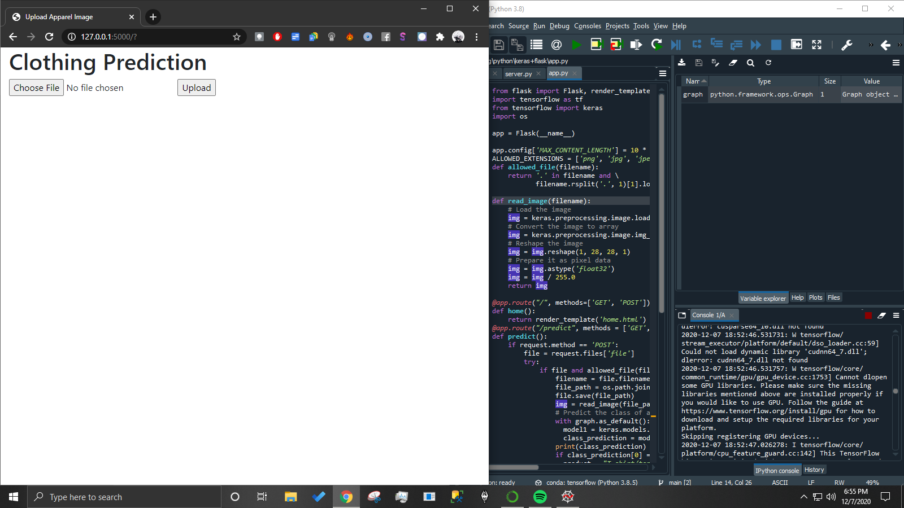
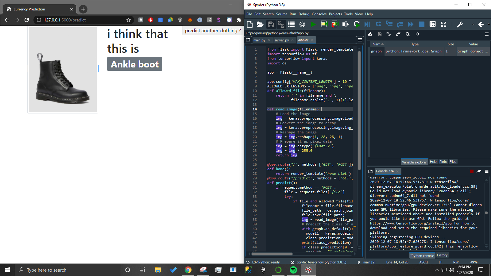

# requirements

<ul>
  <li>tensorflow</li>
  <li>flask</li>
  <li>keras</li>
</ul>

# steps
<ul>
  <li>creation de model</li>
  <li>creation de coté serveur</li>
  <li>creation des templates</li>
  <li> implementer le model </li>
  <li>creation des route</li>
   <li>adding the folder static/images</li>
</ul>

<h2>screenshuts</h2>

